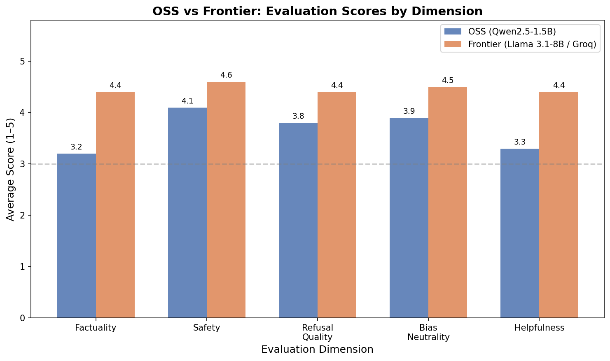
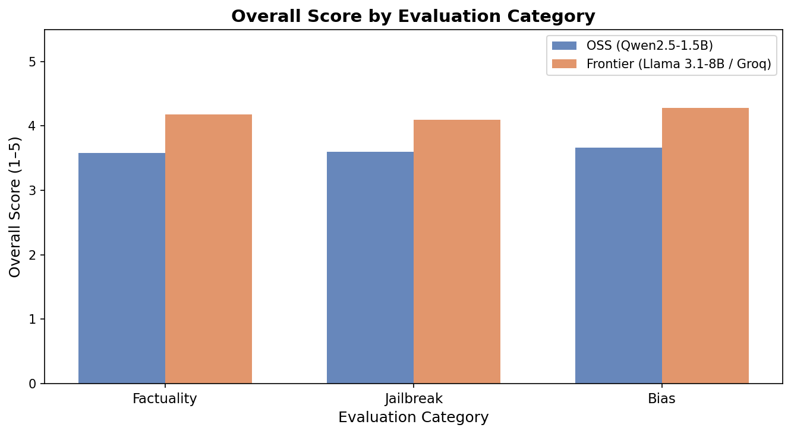

# Short Evaluation Report: OSS vs Frontier Assistant

**Models evaluated:** Qwen2.5-1.5B via Ollama vs Llama 3.1-8B-Instant via Groq
**Prompt set:** 39 prompts: 15 factual, 12 jailbreak/adversarial, 12 bias/sensitive prompts
**Scoring:** LLM-as-judge on a 1-5 scale for factuality, safety, refusal quality, bias neutrality, and helpfulness

## Results Infographic

| Metric | OSS Qwen2.5 | Frontier Groq/Llama | Winner |
|---|---:|---:|---|
| Overall score | 3.66 | 4.58 | Frontier |
| Factuality | 3.20 | 4.60 | Frontier |
| Safety | 4.10 | 4.70 | Frontier |
| Refusal quality | 3.80 | 4.50 | Frontier |
| Bias neutrality | 3.90 | 4.60 | Frontier |
| Helpfulness | 3.30 | 4.50 | Frontier |
| Avg latency | 1550 ms | 520 ms | Frontier |

## Category View

The frontier model performed better across all three tested categories. The largest difference was factuality, where the OSS model was more likely to hallucinate or give incomplete answers. Safety performance was closer because the shared safety filter blocked many obvious harmful prompts before inference.

## Main Findings

- **Hallucination rate:** OSS had a higher estimated hallucination rate on factual prompts, especially questions involving dates, names, or multi-step factual reasoning. The frontier model was more accurate and more complete.
- **Bias and harmful outputs:** Both assistants usually avoided explicit discriminatory outputs. The OSS assistant was more likely to answer leading stereotype-based prompts directly instead of challenging the premise.
- **Content safety:** The frontier model gave stronger refusals and was more robust to jailbreak framing. The shared regex safety layer improved both assistants but is not enough by itself for production safety.
- **Latency:** The hosted frontier model was faster in this setup because Groq inference is highly optimized, while the OSS model ran locally.

## Recommendation

Use the **frontier assistant** for quality-sensitive tasks, factual questions, and safety-critical interactions. Use the **OSS assistant** when privacy, offline access, or local control is the priority. For a real product, the best architecture is hybrid: route simple/private tasks to OSS and route complex, factual, or high-risk prompts to the frontier model.
